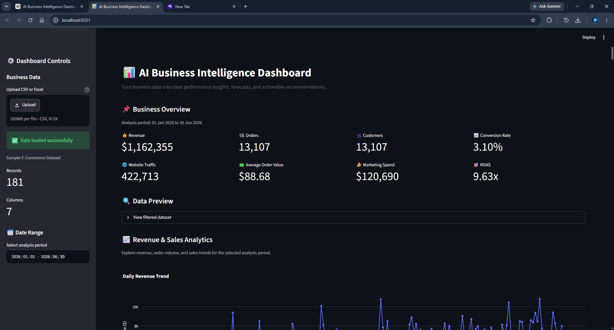
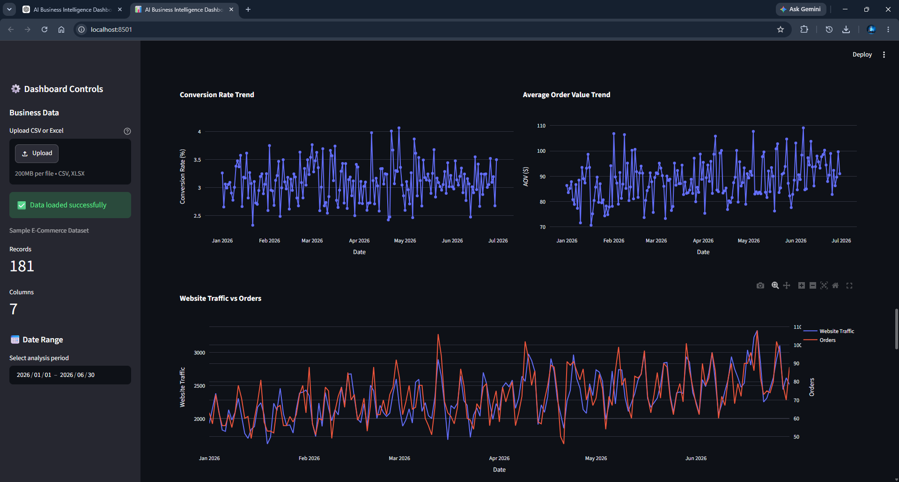
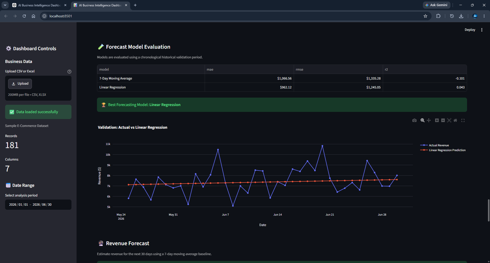
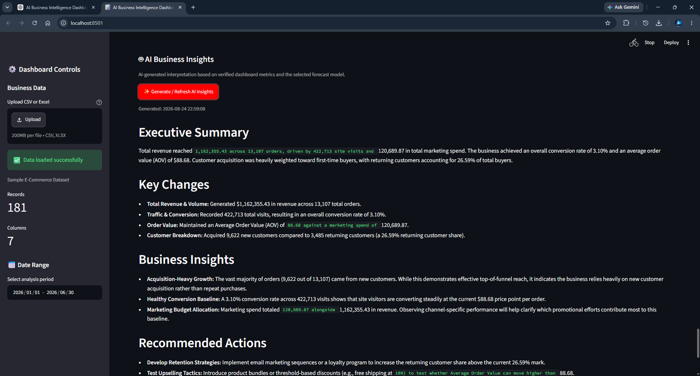
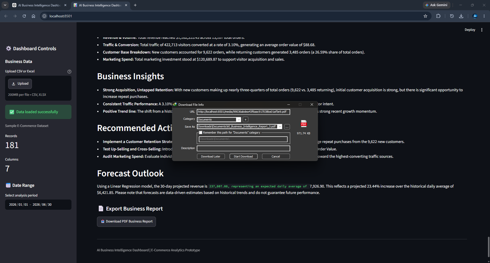

# 📊 AI Business Intelligence Dashboard

An AI-powered business intelligence dashboard that transforms raw sales, marketing, customer, and traffic data into interactive analytics, revenue forecasts, and plain-English business insights.

The system is designed for small businesses that want data-driven decision support without requiring a dedicated data analyst.


## Dashboard Preview



## Contents

- [📊 AI Business Intelligence Dashboard](#-ai-business-intelligence-dashboard)
  - [Dashboard Preview](#dashboard-preview)
  - [Contents](#contents)
  - [Project Overview](#project-overview)
  - [Business Problem](#business-problem)
  - [Target Customers](#target-customers)
  - [Solution](#solution)
  - [Key Features](#key-features)
    - [📈 Business Analytics](#-business-analytics)
    - [🔮 Revenue Forecasting](#-revenue-forecasting)
    - [🤖 AI Business Insights](#-ai-business-insights)
    - [📄 PDF Reports](#-pdf-reports)
    - [🛡️ Data Validation](#️-data-validation)
  - [Technology Stack](#technology-stack)
  - [System Architecture](#system-architecture)
- [17. Analytics Methodology](#17-analytics-methodology)
  - [Analytics](#analytics)
    - [Revenue](#revenue)
    - [Conversion Rate](#conversion-rate)
    - [Average Order Value](#average-order-value)
    - [Marketing Spend](#marketing-spend)
    - [Customer Metrics](#customer-metrics)
  - [Forecasting](#forecasting)
  - [AI Insights](#ai-insights)
- [20. PDF Reporting](#20-pdf-reporting)
  - [PDF Reporting](#pdf-reporting)
  - [Data Validation](#data-validation)
  - [Installation](#installation)
    - [1. Clone the repository](#1-clone-the-repository)
- [23. Usage](#23-usage)
  - [Usage](#usage)
  - [Testing](#testing)
- [25. Screenshots](#25-screenshots)
  - [Screenshots](#screenshots)
    - [Dashboard](#dashboard)
    - [Business Analytics](#business-analytics)
    - [Revenue Forecast](#revenue-forecast)
    - [AI Business Insights](#ai-business-insights)
    - [PDF Report](#pdf-report)
  - [Project Evidence](#project-evidence)
    - [Live Demo](#live-demo)
  - [Business Value](#business-value)
    - [Monthly Subscription](#monthly-subscription)
    - [One-Time Dashboard Build](#one-time-dashboard-build)
  - [Limitations](#limitations)
  - [Future Improvements](#future-improvements)
- [30. Portfolio Summary](#30-portfolio-summary)
  - [Portfolio Summary](#portfolio-summary)
- [30. Portfolio Summary](#30-portfolio-summary-1)
  - [Portfolio Summary](#portfolio-summary-1)
  - [License](#license)

## Project Overview

The AI Business Intelligence Dashboard is a Streamlit-based analytics application that helps small businesses understand their operational and marketing performance.

Instead of manually analyzing spreadsheets, users can view key performance indicators, interactive charts, customer metrics, marketing performance, revenue trends, and a 30-day revenue forecast from a single dashboard.

An LLM-based analysis layer converts verified business metrics into a plain-English weekly summary containing important changes, observations, and recommended actions.

## Business Problem

Small businesses often have sales, marketing, website traffic, and customer information stored across spreadsheets or separate platforms.

This creates several problems:

- Difficult manual reporting
- Limited visibility into business performance
- Time-consuming spreadsheet analysis
- Difficulty identifying important trends
- Limited forecasting capability
- Dependence on external analysts for interpretation

The dashboard addresses these problems by bringing the data into a single analytical interface.

## Target Customers

The product is designed for:

- E-commerce store owners
- Small retail businesses
- Marketing agencies
- Small retail chains
- Businesses that need recurring performance reports
- Non-technical business owners who need simple data-driven insights

## Solution

The system follows a simple workflow:

1. Load business data
2. Validate the dataset
3. Calculate business KPIs
4. Generate interactive visualizations
5. Analyze historical performance
6. Generate a 30-day revenue forecast
7. Send verified metrics to the AI insight layer
8. Generate plain-English recommendations
9. Export the analysis as a PDF report

## Key Features

### 📈 Business Analytics

- Revenue trends
- Order performance
- Website traffic
- Marketing spending
- Customer acquisition
- Returning customers
- Conversion rate
- Average order value

### 🔮 Revenue Forecasting

- 30-day revenue forecast
- Forecast performance summary
- Model-based prediction
- Historical vs forecast visualization

### 🤖 AI Business Insights

The AI layer converts verified metrics into a business-friendly summary covering:

- Key performance changes
- Positive trends
- Potential concerns
- Business observations
- Recommended actions

### 📄 PDF Reports

Users can generate a downloadable business report containing the main metrics, visualizations, forecast information, and AI-generated insights.

### 🛡️ Data Validation

The system validates:

- Required columns
- Missing values
- Duplicate records
- Invalid dates
- Negative values
- Numeric data types
- Date ordering
- Forecast integrity

## Technology Stack

| Technology | Purpose |
|---|---|
| Python | Core application development |
| Pandas | Data processing and analysis |
| NumPy | Numerical calculations |
| Scikit-Learn | Forecasting/modeling |
| Plotly | Interactive visualizations |
| Streamlit | Dashboard interface |
| LLM API | Automated business insights |
| ReportLab | PDF report generation |
| python-dotenv | Environment configuration |
| Git/GitHub | Version control and portfolio |

## System Architecture

```text
                 Business Dataset
                        │
                        ▼
               ┌─────────────────┐
               │ Data Validation │
               └────────┬────────┘
                        │
                        ▼
               ┌─────────────────┐
               │ Data Processing │
               └────────┬────────┘
                        │
             ┌──────────┼──────────┐
             ▼          ▼          ▼
          KPIs       Charts    Forecasting
             │          │          │
             └──────────┼──────────┘
                        ▼
                Verified Metrics
                        │
                        ▼
                 AI Insight Layer
                        │
                        ▼
                Business Summary
                        │
                        ▼
                  PDF Reporting
                        │
                        ▼
                Business Decision


---

# 17. Analytics Methodology

```markdown
## Analytics

The dashboard calculates business metrics directly from the underlying dataset.

Important metrics include:

### Revenue

Total revenue is calculated as:

Revenue = Σ Daily Revenue

### Conversion Rate

Conversion rate is calculated as:

Conversion Rate = Orders / Traffic × 100

### Average Order Value

AOV is calculated as:

AOV = Total Revenue / Total Orders

### Marketing Spend

Marketing spend is aggregated over the selected reporting period.

### Customer Metrics

New and returning customers are aggregated to understand customer acquisition and retention patterns.

## Forecasting

The dashboard generates a 30-day revenue forecast using the forecasting approach implemented in the project.

Candidate forecasting approaches were evaluated during development, and the selected model is used to generate the final forecast.

The dashboard validates the forecast before displaying it to ensure:

- Exactly 30 forecast periods are available
- Dates are valid and ordered
- Forecast values are numeric
- Missing values are absent
- Infinite values are absent
- Negative forecast values are detected

The final implementation uses Linear Regression for the 30-day revenue forecast.

## AI Insights

The AI layer receives verified business metrics rather than raw unvalidated data.

This separation is intentional:

```text
Raw Data
   ↓
Validation
   ↓
KPI Calculation
   ↓
Verified Metrics
   ↓
LLM
   ↓
Business Explanation


This is an important point for your project because **AI should explain the numbers, not invent the numbers**.

---

# 20. PDF Reporting

```markdown
## PDF Reporting

The application can generate a downloadable PDF business report containing the main analytical results.

The report is designed for:

- Weekly management reviews
- Client reporting
- Internal business meetings
- Portfolio demonstrations
- Recurring business performance reporting

## Data Validation

Before business metrics are calculated, the dataset passes through a validation layer.

The validation system checks:

- Required columns
- Empty datasets
- Invalid dates
- Duplicate records
- Missing values
- Negative business values
- Numeric data types
- Chronological ordering

Forecast outputs are also validated before they are presented to the user.

This helps ensure that charts, KPIs, forecasts, AI inputs, and reports are based on consistent data.

## Installation

### 1. Clone the repository

```bash
git clone https://github.com/UmarRafique25/SafeX-Task5-AI-Business-Intelligence-Dashboard
cd AI-Business-Intelligence-Dashboard

# 23. Usage

```markdown
## Usage

After launching the application:

1. Load the business dataset.
2. Select the required date range.
3. Review the KPI dashboard.
4. Analyze revenue, marketing, traffic, and customer trends.
5. Review the 30-day revenue forecast.
6. Generate AI-powered business insights.
7. Export the results as a PDF report.

## Testing

The project includes automated tests for the main analytical components.

Run the complete test suite:

```bash
python run_all_tests.py


---

# 25. Screenshots

```markdown
## Screenshots

### Dashboard


### Business Analytics



### Revenue Forecast



### AI Business Insights



### PDF Report



## Project Evidence

The project was tested across the major application components, including:

- Dashboard and KPI calculations
- Interactive business analytics
- 30-day revenue forecasting
- AI-generated business insights
- PDF report generation
- Automated test suite
- Public GitHub repository
- Live Streamlit deployment

### Live Demo

[Open Live Dashboard](https://safex-task5-ai-business-intelligence-dashboard-pbvf8mnkvmc3aj8.streamlit.app/)
## Business Value

The dashboard is designed around a simple business proposition:

> Convert business data into understandable decisions without requiring a dedicated data analyst.

Potential customers could use the product for recurring performance monitoring and reporting.

Possible commercial models include:

### Monthly Subscription

Approximately:

$50–$200/month

depending on data sources, reporting frequency, customization, and support.

### One-Time Dashboard Build

Approximately:

$200–$600

for a customized dashboard for a small business.

Actual pricing would depend on the customer's requirements, integrations, reporting frequency, and level of customization.

## Limitations

The current prototype has several limitations:

- The sample dataset is simulated/public rather than connected to a customer's live business systems.
- Forecast accuracy depends heavily on the quality and amount of historical data.
- The current forecasting approach is intentionally simple for rapid deployment.
- AI-generated recommendations should be reviewed by a business user before important decisions are made.
- Live integrations with platforms such as Shopify, Google Analytics, Meta Ads, or accounting systems are not included in the current version.

## Future Improvements

Potential future versions could include:

- Shopify integration
- Google Analytics integration
- Meta Ads integration
- Automated weekly email reports
- Multi-business account support
- User authentication
- PostgreSQL database
- Advanced time-series forecasting
- Anomaly detection
- Customer segmentation
- Automated KPI alerts
- Role-based dashboards
- Cloud deployment
- Scheduled report generation


Again, modify this to match your actual structure.

---

# 30. Portfolio Summary

At the end:

```markdown
## Portfolio Summary

This project demonstrates practical skills in:

- Python
- Data analysis
- Data validation
- Business intelligence
- Interactive visualization
- Forecasting
- AI-assisted analytics
- Automated testing
- PDF report generation
- Streamlit application development
- Git/GitHub workflow

The project focuses on turning technical analytics into a practical business-facing product.


Again, modify this to match your actual structure.

---

# 30. Portfolio Summary

At the end:

```markdown
## Portfolio Summary

This project demonstrates practical skills in:

- Python
- Data analysis
- Data validation
- Business intelligence
- Interactive visualization
- Forecasting
- AI-assisted analytics
- Automated testing
- PDF report generation
- Streamlit application development
- Git/GitHub workflow

The project focuses on turning technical analytics into a practical business-facing product.

## License

This project is available for educational and portfolio purposes.