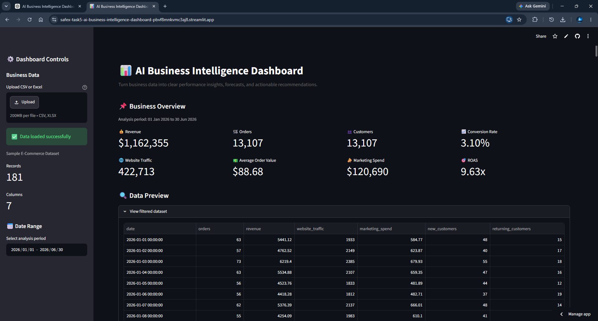
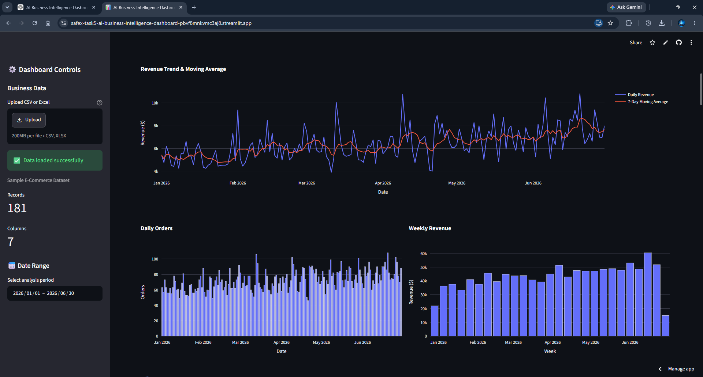
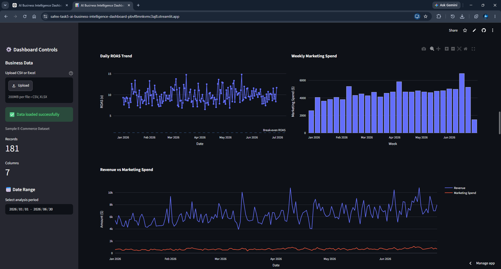
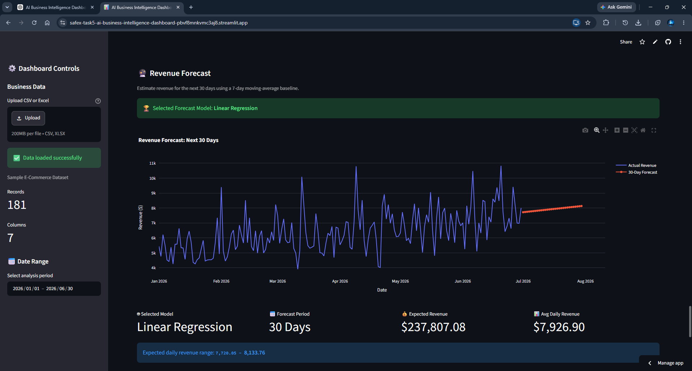
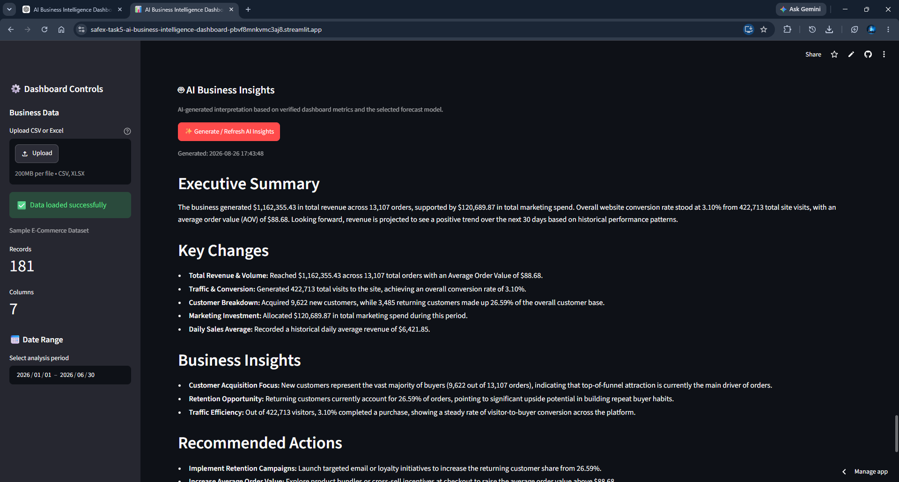

# WEEKLY PROGRESS REPORT

## AI Business Intelligence Dashboard

**Week:** 5  
**Project Type:** AI / Business Intelligence / Data Analytics  
**Difficulty:** Advanced  
**Development Duration:** 6–7 Days

**Prepared for:** SafeX Solutions / University Evaluation

**Project Status:** Completed

## 1. Project Overview

The AI Business Intelligence Dashboard is a data-driven analytics platform designed for small businesses that need a simple way to understand their sales and marketing performance.

Small businesses often have data distributed across spreadsheets and different platforms, making it difficult to identify important trends and make timely decisions. This project provides a centralized dashboard that transforms raw business data into interactive KPIs, visual analytics, revenue forecasts, AI-generated insights, and downloadable business reports.

The system was developed as a practical business intelligence prototype with a focus on usability, automation, forecasting, and actionable decision support.

## 2. Problem Statement

Small business owners may have sales, customer, traffic, and marketing information stored in separate spreadsheets or systems. Analyzing this information manually can be time-consuming and may require technical knowledge or assistance from a data analyst.

The main problem addressed by this project is the lack of a simple and centralized system that can convert raw business data into understandable performance indicators, trends, forecasts, and actionable recommendations.

## 3. Target Customers

The dashboard is primarily designed for:

- E-commerce store owners
- Small retail businesses
- Marketing agencies
- Small retail chains
- Businesses that need automated periodic reporting

## 4. Business Value

The system provides business value by reducing the effort required to analyze business performance manually.

Instead of reviewing raw spreadsheets and calculating metrics individually, users can upload their business data and obtain:

- Key performance indicators
- Revenue and business trends
- Interactive visualizations
- Short-term revenue forecasts
- AI-generated business insights
- Recommended actions
- Downloadable PDF reports

This allows business owners to spend less time preparing reports and more time making decisions based on their data.

## 5. Project Objectives

The main objectives of the project were:

1. Build a centralized business intelligence dashboard.
2. Process and structure raw business data.
3. Calculate important business KPIs automatically.
4. Create interactive charts for business performance analysis.
5. Implement a 30-day revenue forecasting component.
6. Generate plain-English business insights using an LLM.
7. Generate downloadable PDF business reports.
8. Validate calculations and outputs against the underlying data.
9. Deploy the application as a publicly accessible web application.
10. Provide a professional portfolio-ready GitHub repository.

## 6. Technologies and Tools

| Technology | Purpose |
|---|---|
| Python | Core application and data processing |
| Pandas | Data cleaning and analysis |
| NumPy | Numerical operations |
| Plotly | Interactive data visualization |
| Streamlit | Dashboard and web application |
| Scikit-Learn | Forecasting/model development |
| LLM API | AI-generated business insights |
| ReportLab | PDF report generation |
| Kaleido | Chart rendering for reports |
| Git | Version control |
| GitHub | Source code repository |
| Streamlit Community Cloud | Application deployment |

## 7. Development Process

The project was developed through a structured workflow:

### Phase 1: Business Definition

A small e-commerce business scenario was selected as the target use case. The required business metrics and reporting needs were identified.

### Phase 2: Data Preparation

Business data was collected/simulated and structured into a format suitable for analysis. Data validation and cleaning procedures were applied before calculations.

### Phase 3: Business Analytics

Key performance indicators and analytical calculations were implemented, including revenue, orders, customer activity, and other relevant business metrics.

### Phase 4: Interactive Dashboard

The analytics were integrated into a Streamlit dashboard with interactive charts and controls.

### Phase 5: Forecasting

A short-term revenue forecasting component was implemented using a machine learning/regression approach to estimate the next 30 days.

### Phase 6: AI Insights

An LLM API was integrated to convert analytical results into plain-English business observations and recommendations.

### Phase 7: Automated Reporting

A PDF report generation system was integrated so users can export business performance information.

### Phase 8: Testing and Deployment

The dashboard, calculations, forecasting, AI functionality, and PDF reporting were tested before deployment. The application was then deployed as a public Streamlit application.

## 8. Major Features Implemented

### 8.1 Business KPI Dashboard

The dashboard automatically presents important business performance indicators from the uploaded dataset.

### 8.2 Interactive Analytics

Plotly-based interactive visualizations allow users to examine business performance and trends.

### 8.3 Revenue Analysis

The system analyzes historical revenue and presents revenue trends to help identify changes in business performance.

### 8.4 30-Day Forecast

The forecasting module estimates expected revenue for the next 30 days based on historical trends.

### 8.5 AI Business Insights

The LLM analyzes calculated business information and generates understandable observations and recommendations.

### 8.6 PDF Business Report

Users can generate a downloadable business report containing analytical information, forecasting results, and AI-generated insights.

### 8.7 Data Upload

Users can upload business data through CSV or Excel files.

### 8.8 Validation and Testing

The application includes validation and testing procedures to reduce calculation errors and ensure that dashboard results correspond with the underlying dataset.

## 9. System Workflow

The overall system workflow is:

Raw Business Data
        ↓
Data Upload
        ↓
Data Cleaning & Validation
        ↓
KPI Calculation
        ↓
Interactive Visualizations
        ↓
Forecasting
        ↓
AI Business Insights
        ↓
PDF Report Generation
        ↓
Business Decision Support

## 10. Forecasting

A short-term revenue forecasting component was implemented to estimate business revenue for the following 30 days.

The forecasting model uses historical business data to identify the underlying trend and produce future estimates. The forecast is presented as a planning aid rather than a guaranteed prediction.

The dashboard communicates the forecast together with historical performance so that users can compare expected future performance with previous business activity.

## 11. AI-Generated Business Insights

The project integrates an LLM API to convert numerical analytics into plain-English business insights.

Instead of requiring a business owner to interpret every chart manually, the system summarizes important changes and generates practical recommendations.

The AI component focuses on:

- Important performance changes
- Revenue trends
- Business opportunities
- Potential concerns
- Recommended actions

The AI output is generated from the dashboard's analytical results rather than from arbitrary assumptions about the business.

## 12. Testing and Validation

Testing was performed to verify that the application's output corresponds to the underlying business data.

The following areas were checked:

- Dataset loading
- Data validation
- KPI calculations
- Date-based comparisons
- Chart data
- Forecast dates
- Forecast output
- AI insight generation
- PDF report generation
- File upload functionality
- Dashboard functionality

Calculated values were compared against the underlying dataset to identify potential calculation or transformation errors.

The application was also tested after deployment to ensure that cloud-specific dependencies and API configuration were functioning correctly.

## 13. Problems Encountered and Solutions

### Problem 1: Date Utility Import Error

The KPI date comparison functionality initially produced a `ModuleNotFoundError` because the date utility module was not correctly available to the metrics module.

**Solution:**  
The project structure and import configuration were corrected so that the required date utility functions could be accessed correctly.

### Problem 2: AI Insights Not Working After Deployment

AI insights worked in the local environment but initially failed on the deployed application because the local API credentials were not available in the cloud environment.

**Solution:**  
The API key was configured securely through the deployment platform's secrets configuration rather than uploading the `.env` file to GitHub.

### Problem 3: PDF Generation Failed on Streamlit Deployment

The deployed application initially displayed a Kaleido error indicating that Chrome was required for chart rendering.

**Solution:**  
The required browser dependency was added through `packages.txt`, and the required Kaleido dependency was included in the project environment.

### Problem 4: Environment Security

The application required an API key for AI functionality.

**Solution:**  
The real API key was kept outside the GitHub repository. An `.env.example` template was created to document the required environment variable without exposing the actual credential.

## 14. Deployment

The application was deployed using Streamlit Community Cloud and connected to the project's GitHub repository.

The deployment provides a publicly accessible dashboard that can be opened through a web browser without requiring the user to run the project locally.

The deployed application was tested after deployment to verify:

- Dashboard loading
- Data processing
- KPI calculations
- Interactive charts
- Forecasting
- AI-generated insights
- PDF report generation

## 15. Commercial Potential

The dashboard can potentially be offered as a business reporting service for small businesses that do not have dedicated data analysts.

Possible pricing models include:

### Monthly Subscription

Approximately $50–$200 per month depending on reporting frequency, customization, number of data sources, and business requirements.

### One-Time Dashboard Development

Approximately $200–$600 for a customized dashboard implementation.

Potential future upgrades could include:

- Multiple data-source integrations
- Automated weekly email reports
- Advanced forecasting
- Customer segmentation
- Marketing attribution
- Role-based access
- Industry-specific dashboards
- Automated scheduled reporting

## 16. Project Results

The project successfully produced a working business intelligence prototype capable of:

- Processing business datasets
- Calculating business KPIs
- Visualizing performance trends
- Producing a 30-day revenue forecast
- Generating AI-written business insights
- Producing downloadable PDF reports
- Running through a web-based Streamlit interface
- Being accessed through a public deployment
- Maintaining source code in a GitHub repository

## 17. Project Screenshots

### Dashboard Overview

### KPI Analytics

### Business Charts

### Revenue Forecast

### AI Business Insights

### PDF Report

## 18. Project Links

### GitHub Repository

[GitHub Repository](https://github.com/UmarRafique25/SafeX-Task5-AI-Business-Intelligence-Dashboard)

### Live Demo

[AI Business Intelligence Dashboard](https://safex-task5-ai-business-intelligence-dashboard-pbvf8mnkvmc3aj8.streamlit.app/)

## 19. Lessons Learned

During the development of this project, I gained practical experience in:

- Business-oriented data analysis
- Data cleaning and validation
- KPI design
- Interactive dashboard development
- Regression-based forecasting
- LLM integration
- Automated report generation
- Cloud deployment
- Environment and API-key management
- Git and GitHub workflow
- Software testing and debugging

The project also demonstrated the difference between building an ML model independently and integrating analytics, machine learning, AI, and user interface components into a complete business application.

## 20. Next Week's Plan

Future development will focus on improving the dashboard from a prototype into a more production-oriented business intelligence product.

Planned improvements include:

1. Improve dashboard performance.
2. Add more business data sources.
3. Add automated scheduled reports.
4. Improve forecasting methodology.
5. Add customer and product-level analytics.
6. Improve AI insight validation.
7. Add user authentication.
8. Improve mobile responsiveness.
9. Add configurable business KPIs.
10. Explore additional deployment and commercial options.

## 21. Conclusion

The AI Business Intelligence Dashboard successfully demonstrates how data analytics, visualization, forecasting, and generative AI can be combined into a practical business intelligence solution.

The completed prototype allows a small business user to move from raw business data to understandable performance metrics, interactive visualizations, future revenue estimates, AI-generated recommendations, and a downloadable business report.

The project also demonstrates a complete development workflow from data preparation and model development to testing, GitHub version control, cloud deployment, and portfolio presentation.